# Évoli - FLE Agent

An AI-powered French language learning platform by **Évoli** that generates personalized exercises and delivers them weekly to subscribers as PDF newsletters.

**Live:** https://fle-agent.onrender.com

---

## What It Does

- **Generate exercises on demand** — pick a CEFR level (A1–C1) and a topic, get a full French reading exercise with MCQs, vocabulary, and an open question
- **Download as PDF** — styled 4-page PDF (text → questions → vocabulary → answer key)
- **Subscribe to a weekly newsletter** — every Monday, new AI-generated exercises are delivered to subscribers as personalized PDFs via email
- **Manage preferences** — subscribers can update their level/topic or unsubscribe at any time

---

## Tech Stack

| Layer | Technology | Purpose |
|---|---|---|
| Web framework | Flask + Jinja2 | UI, routing, session management |
| AI | Claude API (Anthropic SDK) | Generate French texts, MCQs, vocabulary |
| Database | Supabase (PostgreSQL) | Store exercises and subscribers |
| Email | Gmail OAuth2 API | Send PDF newsletters |
| PDF | fpdf2 + DejaVuSans fonts | Build styled, Unicode-safe PDFs |
| Scheduling | GitHub Actions | Trigger weekly batch jobs reliably |
| Deployment | Render.com + Gunicorn | Production hosting |

---

## Features

### Exercise Generator
- 5 CEFR levels: A1 · A2 · B1 · B2 · C1
- 7 topics: Daily Life · Health · Education · Travel · Environment · Technology · Culture & History
- Bilingual UI (French / English)
- Timer per question, client-side scoring
- Fun cultural fact on each exercise page

### PDF Export
Each PDF is 4 pages:
1. French reading passage (level-appropriate length)
2. 5 multiple-choice questions + open-ended reflection prompt
3. Vocabulary table (word, part of speech, French definition, English translation)
4. Answer key with explanations

### Weekly Newsletter
- Every Monday 06:00 Paris time: generate fresh exercises via Claude API, insert into Supabase
- Every Monday 09:00 Paris time: send each subscriber their preferred level+topic as a PDF email
- GitHub Actions wakes the Render app to ensure jobs run even if the server is sleeping

---

## Architecture



---

## Repository Structure

```
FLE-agent/
│
├── app.py                          # Flask app, routes, APScheduler
├── requirements.txt                # Python dependencies
├── Procfile                        # Render.com: gunicorn entrypoint
│
├── tools/                          # Deterministic execution scripts
│   ├── generate_lesson.py          # Claude API → full lesson JSON (text + MCQs + vocab)
│   ├── build_pdf.py                # Lesson JSON → styled 4-page PDF
│   ├── send_email.py               # Send PDF to subscriber via Gmail OAuth2
│   ├── weekly_generate.py          # Batch: generate all exercises (5 levels × 7 topics)
│   ├── upsert_lesson.py            # Insert lesson JSON into Supabase
│   └── get_gmail_token.py          # One-time: obtain Gmail OAuth2 refresh token
│
├── workflows/                      # Markdown SOPs (instructions for AI agents)
│   ├── generate_french_exercise.md         # SOP: generate one exercise + PDF
│   ├── send_french_exercise_newsletter.md  # SOP: email PDF to subscriber
│   └── weekly_content_pipeline.md         # SOP: Monday batch pipeline
│
├── templates/                      # Jinja2 HTML templates
│   ├── layout.html                 # Base template (navbar, footer, lang toggle)
│   ├── index.html                  # Home: exercise generator + newsletter signup
│   ├── exercise.html               # Exercise page: MCQs, vocabulary, fun fact
│   └── manage.html                 # Subscriber preferences + unsubscribe
│
├── static/
│   ├── css/style.css               # UI styling (matches PDF color palette)
│   └── js/exercise.js              # Timer, MCQ validation, scoring
│
├── fonts/                          # DejaVuSans (Unicode support for PDF)
│
├── .github/
│   └── workflows/
│       └── weekly_schedule.yml     # GitHub Actions: trigger newsletter Mon 08:00 UTC (09:00 Paris)
│
├── .env                            # Secrets (never committed)
└── .gitignore
```

---

## Database Schema

### `exercises`
Append-only. Each weekly batch inserts 35 new rows.

| Column | Type | Description |
|---|---|---|
| `id` | UUID | Primary key |
| `level` | TEXT | CEFR level (A1–C1) |
| `topic` | TEXT | Topic key |
| `text` | TEXT | Generated French passage |
| `word_count` | INT | Word count of passage |
| `questions` | JSONB | Array of 5 MCQ objects |
| `vocabulary` | JSONB | Array of 8–10 vocabulary items |
| `open_question` | TEXT | Open-ended reflection question |
| `url` | TEXT | Source/reference URL |
| `created_at` | TIMESTAMP | Batch timestamp (newsletter picks latest) |

### `subscribers`

| Column | Type | Description |
|---|---|---|
| `id` | UUID | Primary key |
| `email` | TEXT | Unique email address |
| `name` | TEXT | First name |
| `level` | TEXT | Preferred CEFR level |
| `topic` | TEXT | Preferred topic |
| `token` | TEXT | Token for manage/unsubscribe links |
| `subscribed_at` | TIMESTAMP | Signup timestamp |

### `fun_facts`
Cultural facts displayed on exercise pages, keyed by topic.

---

## CEFR Levels & Topics

| Level | Description | Passage Length |
|---|---|---|
| A1 | Beginner | 100–300 words |
| A2 | Elementary | 120–350 words |
| B1 | Intermediate | 200–450 words |
| B2 | Upper-Intermediate | 300–600 words |
| C1 | Advanced | 350–650 words |

| Topic Key | Display Name |
|---|---|
| `vie_quotidienne` | Daily Life & Society |
| `sante_bien_etre` | Health & Wellness |
| `education_apprentissage` | Education & Learning |
| `voyages_tourisme` | Travel & Tourism |
| `environnement_ecologie` | Environment & Ecology |
| `technologie_numerique` | Technology & Digital Life |
| `culture_histoire` | French Culture & History |

---

## Local Development

```bash
# 1. Clone and enter the repo
git clone https://github.com/nuvita97/fle-agent.git
cd FLE-agent

# 2. Create virtual environment
python3 -m venv .venv
source .venv/bin/activate

# 3. Install dependencies
pip install -r requirements.txt

# 4. Set up environment variables
cp .env.example .env
# Fill in: ANTHROPIC_API_KEY, SUPABASE_URL, SUPABASE_KEY,
#          GMAIL_CLIENT_ID, GMAIL_CLIENT_SECRET, GMAIL_REFRESH_TOKEN,
#          EMAIL_SENDER, ADMIN_TOKEN, FLASK_SECRET_KEY

# 5. Run the app
python app.py
# → http://localhost:5001
```

### Useful Commands

```bash
# Generate a single exercise
.venv/bin/python tools/generate_lesson.py --level B1 --topic voyages_tourisme

# Run the full weekly batch
.venv/bin/python tools/weekly_generate.py
```

---

## Deployment (Render.com)

- `Procfile` runs `gunicorn app:app --workers 2 --timeout 120`
- Set all environment variables in the Render dashboard
- APScheduler starts automatically on app boot
- GitHub Actions (`.github/workflows/weekly_schedule.yml`) hits the `/admin/trigger-*` endpoints to ensure jobs run even when Render's free tier has put the app to sleep

---

## WAT Framework

This project is built on the **WAT framework** — Workflows, Agents, Tools — which separates AI reasoning from deterministic execution:

| Layer | Role | Location |
|---|---|---|
| **Workflows** | Plain-language SOPs defining what to do and when | `workflows/*.md` |
| **Agents** | AI handles orchestration, decision-making, error recovery | (Claude Code) |
| **Tools** | Python scripts do the actual work: API calls, PDF building, email | `tools/*.py` |

Each tool is independently testable and callable from both the Flask app and the command line. Workflows evolve as the system learns — rate limits, API quirks, and better approaches get documented back into the SOP.

---

## Environment Variables

```env
# Claude API
ANTHROPIC_API_KEY=
CLAUDE_MODEL=claude-sonnet-4-6

# Supabase
SUPABASE_URL=
SUPABASE_KEY=

# Gmail OAuth2
GMAIL_CLIENT_ID=
GMAIL_CLIENT_SECRET=
GMAIL_REFRESH_TOKEN=
EMAIL_SENDER=

# App
ADMIN_TOKEN=
FLASK_SECRET_KEY=
BASE_URL=http://localhost:5001
PUBLIC_URL=https://fle-agent.onrender.com
```
